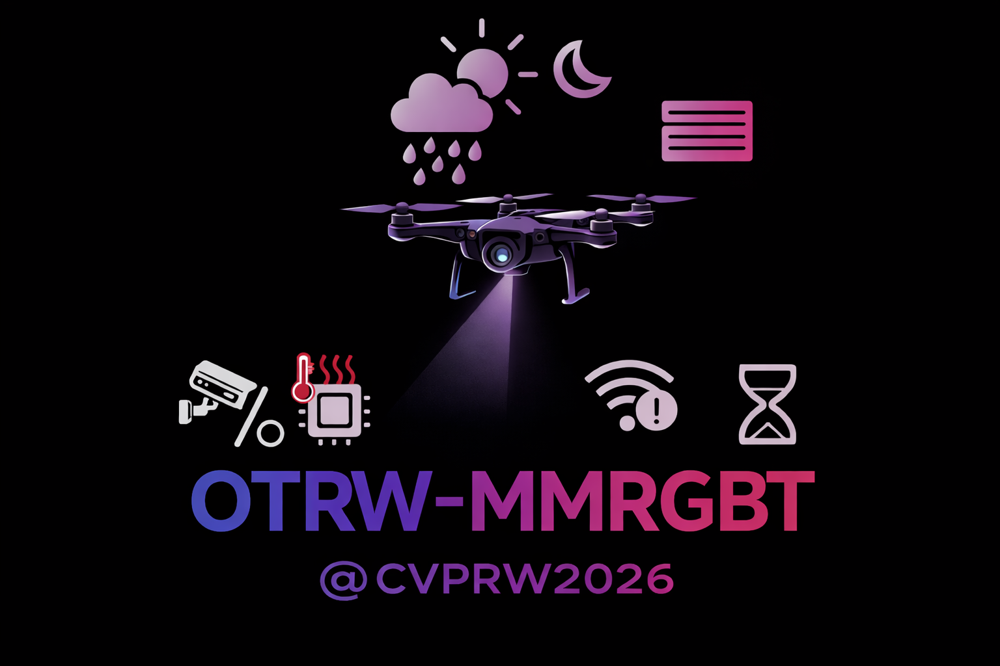

# URVIS 2026 Object Tracking Challenge - Modality-Missing RGBT Tracking

<p align="center">
  
</p>

This repository provides an overview of the **URVIS 2026 Object Tracking Challenge**, including the challenge description, datasets, final evaluation results and Code.

👉 Challenge Website: https://urvis-workshop.github.io/challenge-object-tracking.html

---

## 🔍 Challenge Overview

The **URVIS 2026 Object Tracking Challenge** focuses on advancing research in **robust visual object tracking** under challenging real-world conditions. The challenge aims to evaluate algorithms in scenarios involving:

- Modality-missing  
- Drastic appearance changes  
- Multi-modal inconsistencies  
- Complex backgrounds and motion  

Participants are encouraged to develop methods that are **robust, efficient, and generalizable**.

The challenge consists of two tracks:

- **Main Track**: Standard object tracking setting  
- **Special Track**: More challenging scenarios with additional constraints  

---

## 📊 Dataset

The challenge dataset is designed to evaluate tracking performance under diverse and realistic conditions.

### Key Features:
- Multi-scenario evaluation (e.g., occlusion, fast motion)
- Diverse object categories
- High-quality annotations
- Hidden test set for fair evaluation

### Data Split:
- **Training Set**: Publicly available for model training  
- **Validation Set**: Used for intermediate evaluation  
- **Test Set**: Unreleased, used for final ranking  

> ⚠️ The final rankings are determined based on performance on the **unreleased test set**.

> ⭐ The dataset is available for download at the [link](https://drive.google.com/file/d/1WgUIGwp-mwbEKmvmFyoAc4Tq1aig-lqp/view?usp=drive_link) and the results on unreleased test set are available at the [link](https://drive.google.com/file/d/1WgUIGwp-mwbEKmvmFyoAc4Tq1aig-lqp/view?usp=drive_link).

---

## 🏆 Final Results

### Main Track

| Rank | Team   | Method      | Score | PR_t | SR_t | PR_m | SR_m |
|------|--------|------------|-------|------|------|------|------|
| 1    | JST1   | LoraRGBT   | 1.43  | 0.82 | 0.60 | 0.83 | 0.62 |
| 2    | SDMoE  | SDMoE-L    | 1.34  | 0.78 | 0.54 | 0.80 | 0.56 |
| 3    | SJTU1  | MM_SAM     | 1.33  | 0.77 | 0.55 | 0.78 | 0.56 |
| 4    | KTeam1 | MADCTrack  | 1.17  | 0.69 | 0.48 | 0.70 | 0.48 |

---

### Special Track

| Rank | Team      | Method        | Score | PR_t | SR_t | PR_m | SR_m |
|------|-----------|--------------|-------|------|------|------|------|
| 1    | JST2      | GLATrack     | 1.31  | 0.77 | 0.53 | 0.78 | 0.54 |
| 2    | KTeam2    | KTeam2Track  | 1.30  | 0.75 | 0.54 | 0.76 | 0.55 |
| 3    | TEAM NAME | M2-IPL       | 1.141 | 0.67 | 0.46 | 0.68 | 0.47 |
| 4    | SJTU2     | MM_IPL       | 1.137 | 0.65 | 0.48 | 0.66 | 0.49 |

---

## 📌 Evaluation Metrics

The evaluation is based on multiple metrics:

- **Score**: Overall ranking metric  
- **PR_t / SR_t**: Precision / Success Rate on thermal modality  
- **PR_m / SR_m**: Precision / Success Rate on multi-modal setting  

---

## 🔗 Code Links

We provide the official implementations (if available) for participating teams below:

### Main Track

| Rank | Team   | Method    | Code |
|------|--------|----------|------|
| 1    | JST1   | LoraRGBT | [Link](#) |
| 2    | SDMoE  | SDMoE-L  | [Link](#) |
| 3    | SJTU1  | MM_SAM   | [Link](#) |
| 4    | KTeam1 | MADCTrack| [Link](#) |

---

### Special Track

| Rank | Team      | Method       | Code |
|------|-----------|-------------|------|
| 1    | JST2      | GLATrack    | [Link](#) |
| 2    | KTeam2    | KTeam2Track | [Link](#) |
| 3    | TEAM NAME | M2-IPL      | [Link](#) |
| 4    | SJTU2     | MM_IPL      | [Link](#) |

---

> 📌 Note: Please replace `#` with the actual repository links.  
> If your code is not yet public, you may update it later.


<!-- ## 📬 Contact -->

<!-- If you have any questions about the challenge, feel free to contact the organizers. -->

---

<!-- ## 📖 Citation

If you find this challenge useful, please consider citing:

```bibtex
@misc{urvis2026challenge,
  title={URVIS 2026 Object Tracking Challenge},
  year={2026}
} -->
